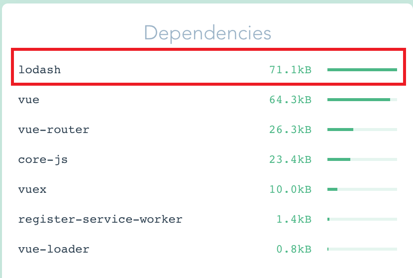
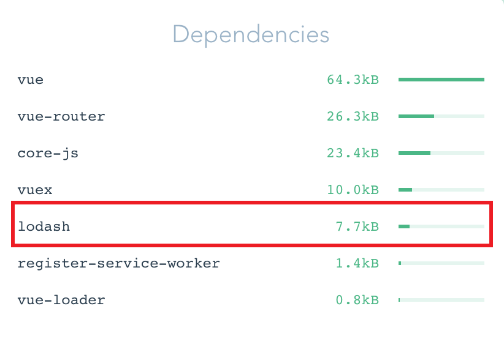
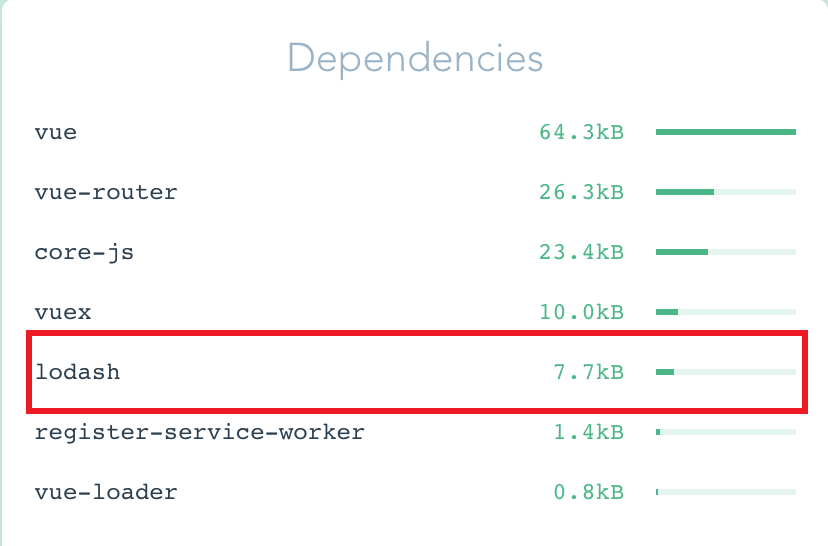

# vue-bundle-analyzer

## lodash bundle analyzer

### Import specific methods inside of curly brackets

```js
import { get } from 'lodash'
// @ is an alias to /src
import HelloWorld from '@/components/HelloWorld.vue'

export default {
  name: 'Home',
  components: {
    HelloWorld
  },
  data () {
    return {
      person: {
        age: 18,
        name: 'Alex'
      }
    }
  },
  computed: {
    msg () {
      return `Hello, ${get(this.person, 'name')}. Welcome to Vue.js!`
    }
  }
}
```



### Import specific methods one by one

```js
import _get from 'lodash/get'
// @ is an alias to /src
import HelloWorld from '@/components/HelloWorld.vue'

export default {
  name: 'Home',
  components: {
    HelloWorld
  },
  data () {
    return {
      person: {
        age: 18,
        name: 'Alex'
      }
    }
  },
  computed: {
    msg () {
      return `Hello, ${_get(this.person, 'name')}. Welcome to Vue.js!`
    }
  }
}
```



### Work with babel-plugin-lodash

Github: <https://github.com/lodash/babel-plugin-lodash>

```bash
yarn add babel-plugin-lodash @babel/cli @babel/preset-env -D
```

With the helper of `babel-plugin-lodash`, web can use both of the following two ways:

```js
import _ from 'lodash'
_.get(this.person, 'name')
```

```js
import { get } from 'lodash'
get(this.person, 'name')
```

They will be transformed roughly to, which is same as the [Import specific methods inside of curly brackets](#Import specific methods inside of curly brackets).

```js
import _get from 'lodash/get'
_get(this.person, 'name')
```


